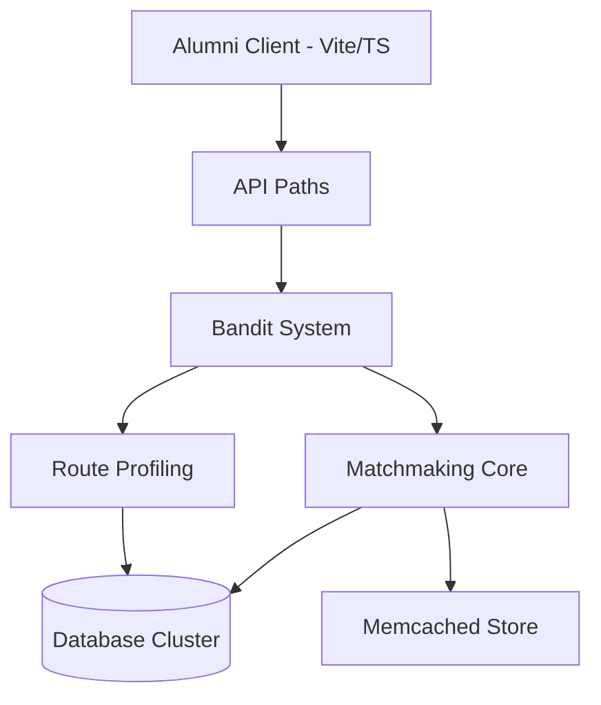
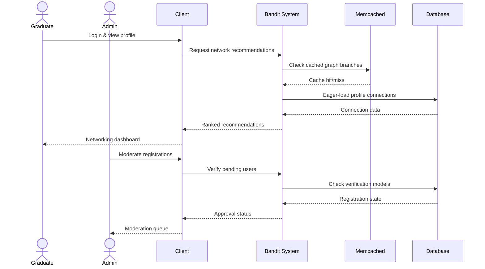

## System Architecture

The alumni portal uses a Vite + TypeScript frontend communicating with a Bandit backend system. Bandit handles both route profiling (determining optimal data access patterns) and matchmaking (generating alumni connection recommendations). The database cluster stores all profile and relationship data while Memcached provides O(1) lookup for frequently-accessed graph branches.

## System Flow

1. **User authenticates** and their profile is loaded from the database cluster
2. **Bandit Matchmaking** evaluates the user's graph position
3. **Eager loading policies** fetch connected profiles in batch
4. **Memcached** serves cached relationship branches when available
5. **Recommendations** are ranked by connection strength and relevance
6. **Client renders** the networking dashboard

## User Flow

## Challenges & Solutions

### Graph-Based Recommendations

The alumni network connects thousands of graduates through multiple relationship types (classmates, colleagues, mentors, shared interests). Naively traversing this graph for every recommendation request caused unacceptable latency.

**Solution:** Eager loading policies were implemented at the ORM level, pre-fetching relationship branches in batch. Key-based Memcached indexes store the most active graph branches (users who logged in within the last 30 days, recently updated profiles), enabling O(1) retrieval for the majority of requests.

### Multi-Tier Registration Security

The platform supports different user types (students, graduates, faculty, employers) each with distinct registration flows and verification requirements. Managing state across these tiers securely was complex.

**Solution:** Each user type has its own verification model in the database, linked to the core user record. Route middleware checks registration state at each step, ensuring no user can skip verification stages or access unauthorized flows. This approach kept the codebase modular while maintaining strict security boundaries.
