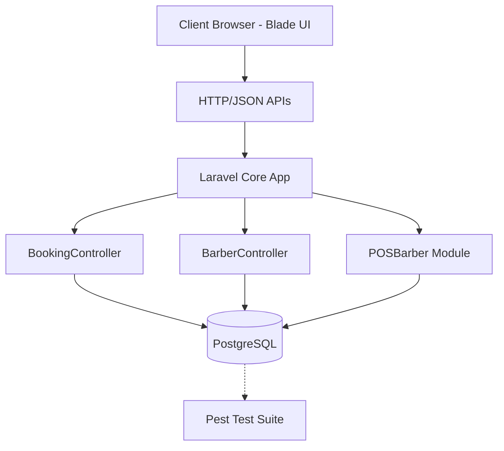
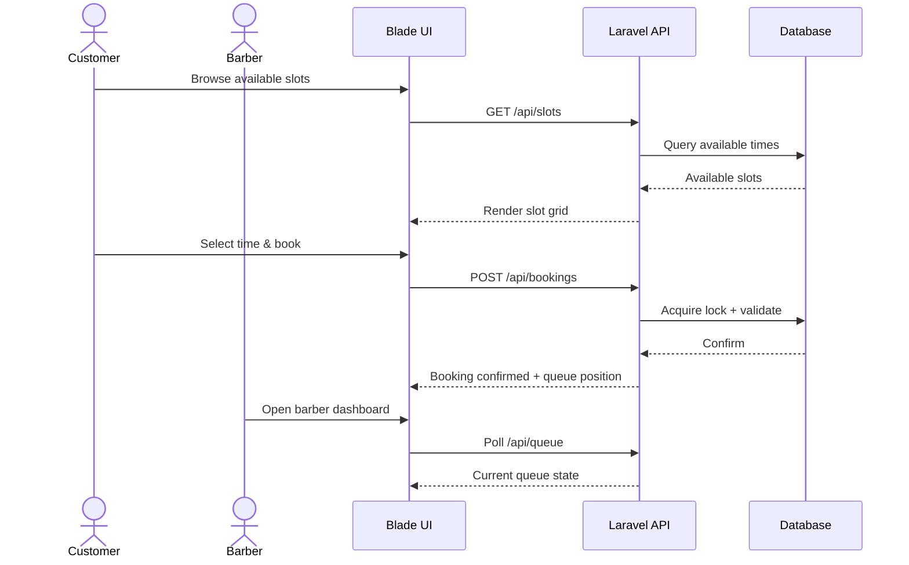

## System Architecture

The system follows a monolithic Laravel architecture with clear separation of concerns. The Blade frontend communicates with the Laravel backend through RESTful JSON APIs. Core business logic is distributed across three controllers, each responsible for a distinct domain: booking, barber management, and point-of-sale.

## System Flow

1. **Customer browses** available time slots via the Blade UI
2. **Booking request** is sent as a JSON POST to `BookingController`
3. **Pessimistic lock** is acquired on the target time slot row
4. **Validation layer** runs multi-layered Eloquent rules (no double-booking, shop hours, barber availability)
5. **Transaction commits** and queue position is assigned
6. **Event dispatcher** broadcasts the updated queue state
7. **Barber dashboard** polls the API and reflects changes in real-time

## User Flow

## Challenges & Solutions

### Concurrency & Double-Booking

The primary technical challenge was preventing race conditions during high-frequency booking spikes. Multiple customers could request the same time slot within milliseconds.

**Solution:** Pessimistic database locks were implemented at the transaction level. Before any booking is created, the system acquires a `FOR UPDATE` lock on the target time slot row. Combined with Eloquent's validation pipeline, this guarantees that only one booking transaction succeeds per slot.

### Real-Time Queue Sync

Customer-facing queue counters and barber dashboards needed to reflect state changes instantly without expensive WebSocket infrastructure.

**Solution:** An active polling mechanism was paired with a transactional event dispatch system. Whenever a booking state changes, the dispatcher broadcasts the delta to all active frontend sessions. The polling interval is adaptive — shorter during peak hours, longer during idle periods — keeping server load predictable.
