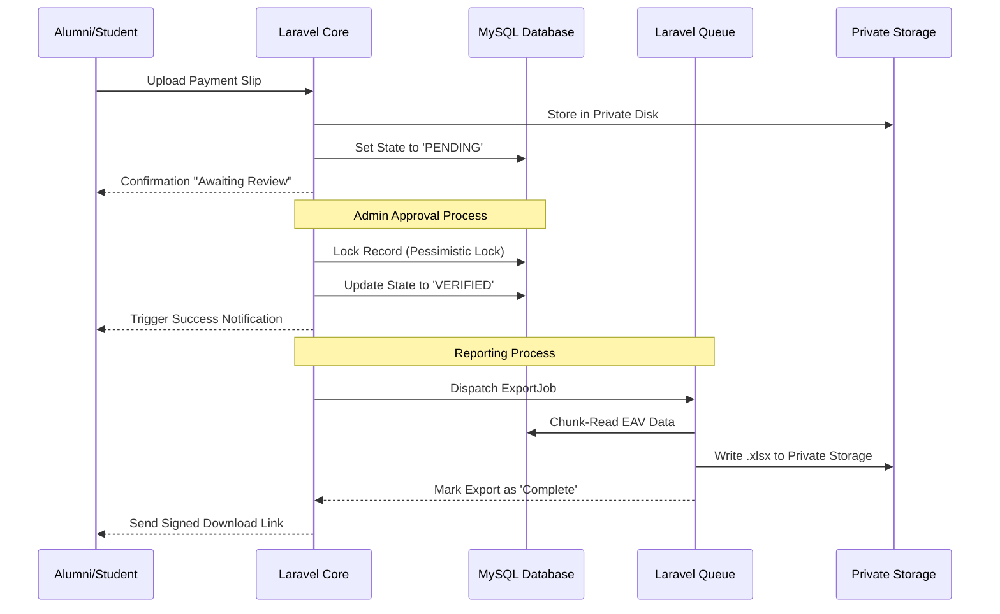

# Graduated System CPRU — Architecture

This document outlines the finalized architectural decisions and implementation patterns for the **CPRU Alumni Regis System**. These patterns are designed to ensure scalability, security, and maintainability as the system grows.

## Project Overview

**Graduated System CPRU** is a digital transformation of the alumni registration and management process for CPRU Rajabhat University. It transitions a previously paper-based workflow into a professional, warmly efficient digital platform.

---

## Tech Stack

- **Backend:** PHP 8.2+, Laravel 12
- **Database:** MySQL (via Eloquent ORM)
- **Frontend:** Bootstrap 5.3.3, Material Dashboard, Vite, Bai Jamjuree Typography
- **Key Integrations:** Maatwebsite/Excel, Intervention/Image, DomPDF, Simple-QRCode

---

## Core Architectural Decisions

### 1. Payment Verification Loop (State Machine)

To ensure the integrity of financial verification, the system implements a formal **State Machine** for payment statuses.

- **States:** `PENDING` -> `UNDER_REVIEW` -> `VERIFIED` | `REJECTED`.
- **Idempotency:** Use of atomic locks (`Cache::lock`) during approval to prevent race conditions.
- **Auditability:** Every state change is recorded in a `payment_logs` table (Who, When, Previous State, New State, Reason).

### 2. Dynamic Form System (Normalized EAV)

To support flexible registration forms without compromising database performance or queryability, the system uses an **Entity-Attribute-Value (EAV)** inspired approach.

- **Schema Structure:**
    - `forms`: General metadata for a registration form.
    - `form_fields`: Definitions of fields (Type, Label, Validation Rules, Order).
    - `form_responses`: A vertical table storing `(response_id, field_id, value)`.
- **Benefit:** Allows admins to add custom fields on-the-fly while maintaining the ability to perform indexed SQL queries for reporting.

### 3. Authorization & Security (RBAC + Policies)

Access control is managed via a combination of **Role-Based Access Control (RBAC)** and **Laravel Policies**.

- **Roles:** Defined tiers (e.g., `SUPER_ADMIN`, `DEPT_ADMIN`, `ALUMNI`).
- **Enforcement:** Logic is centralized in `Policies` rather than controllers.
- **Data Isolation:** Use of **Global Scopes** to ensure `DEPT_ADMIN` can only access records belonging to their specific faculty, preventing IDOR (Insecure Direct Object Reference) attacks.

### 4. High-Volume Reporting (Async Queue Export)

To prevent server timeouts and memory exhaustion during large alumni data exports, the system utilizes **Asynchronous Queue Processing**.

- **Workflow:**
    1. Admin triggers export -> Job dispatched to queue -> Immediate "Processing" response.
    2. **Chunking:** `Maatwebsite/Excel` processes data in chunks (via `WithChunkReading`) to maintain a low memory footprint.
    3. **Delivery:** Upon completion, a notification is sent to the Admin with a **Temporary Signed URL** to download the file.

### 5. Binary Asset Management (Private Storage)

Sensitive documents (payment slips, private IDs) are decoupled from the public web directory to prevent unauthorized access.

- **Storage Strategy:** Files are stored on a **Private Disk** (`storage/app/private`).
- **Access Control:** Files are never served via direct URL. Instead, the system generates a **Temporary Signed URL** that expires shortly after generation.
- **Optimization:** All profile images pass through an `Intervention/Image` pipeline to normalize resolution and compress files into WebP format.

### 6. API Evolution (URI Versioning)

To ensure stability between the backend and frontend (or future mobile apps), the API follows a strict versioning and response contract.

- **Versioning:** All endpoints are prefixed by version (e.g., `/api/v1/alumni`).
- **Response Envelope:** Every response follows a standardized JSON structure:
  ```json
  {
    "success": boolean,
    "data": object|array,
    "message": string,
    "meta": { "version": "1.0" }
  }
  ```

---

## System Sequence Flow



## Design Philosophy

- **Warm Efficiency:** Balancing a professional tool with an approachable university feel.
- **Silk Pink Rarity Rule:** Primary accent color (`#e91e63`) used on 10% or less of the UI to maintain focus.
- **Thai-First:** `Bai Jamjuree` used across all levels for optimal Thai-Latin legibility.
