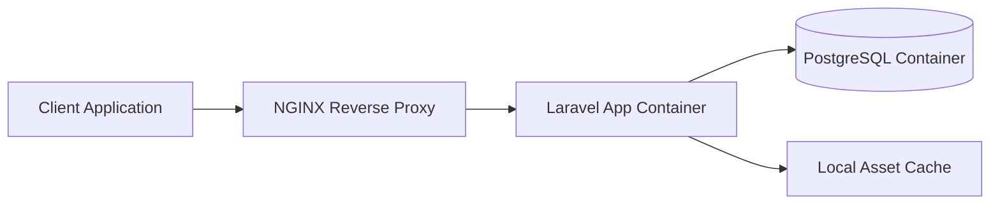
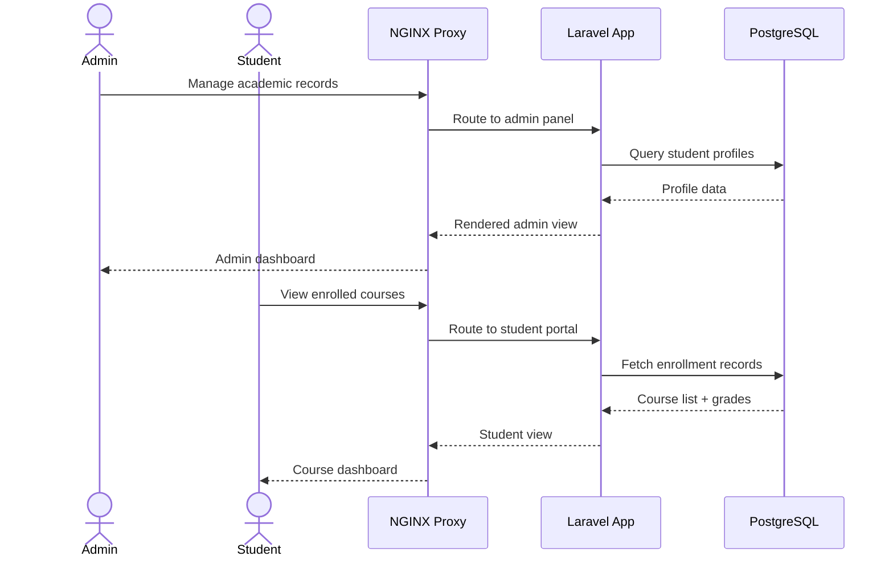

## System Architecture

The system is fully containerized using Docker. An NGINX reverse proxy routes all incoming traffic to the Laravel application container, which communicates with a dedicated PostgreSQL container over TCP. Static assets and cache data are stored on layered Docker volumes, enabling fast rebuilds without data loss.

## System Flow

1. **Client request** hits the NGINX reverse proxy
2. **Proxy routes** to the Laravel app container based on path prefix
3. **App processes** the request — queries PostgreSQL, checks cache
4. **Database** returns results via indexed composite key lookups
5. **Response** is assembled and returned through the proxy
6. **Health checks** run on each container every 30 seconds

## User Flow

## Challenges & Solutions

### Startup Time & Memory Footprint

Development containers were taking over 45 seconds to start, breaking the developer feedback loop. The image size bloated to over 1.2 GB due to unnecessary build artifacts.

**Solution:** Multi-stage Docker builds were introduced. The build stage compiles assets and installs dev dependencies, while the runtime stage copies only what's needed. Volume mounts were reorganized to separate static cache (rarely changes) from dynamic data, allowing Docker to reuse cached layers.

### Nested Academic Record Sync

University data models have deeply nested relationships — students belong to departments, enroll in courses, which have professors, schedules, and grade records. Querying this hierarchy efficiently was non-trivial.

**Solution:** Composite indexes were designed for the most common query patterns (e.g., `(department_id, enrollment_year)`, `(student_id, semester)`). Database triggers maintain referential integrity across related tables, and automated seeders populate realistic test data with a single command.
