# University Database System — Architecture

A production-grade PDF management platform purpose-built for university academic document workflows. This document covers system architecture, data flow, user roles, and design decisions.

---

## Project Architecture

### High-Level Structure

```
university-database-system/
├── prisma/             # Database schema + seed
├── public/             # Static assets
├── src/
│   ├── app/            # Next.js App Router (pages + API routes)
│   ├── components/     # Reusable UI components
│   ├── hooks/          # Custom React hooks
│   └── lib/            # Server Actions, auth config, utilities
├── uploads/            # Local file storage (fallback)
├── nginx/              # Reverse proxy + SSL config
├── docker-compose.yml  # Multi-service orchestration
├── Dockerfile          # App container
└── components.json     # shadcn/ui config
```

### Route Grouping

| Group | Path | Auth Required | Description |
|-------|------|--------------|-------------|
| `(app)/` | `/dashboard`, `/pdfs`, `/categories`, `/admins`, `/settings` | Yes (Editor/Admin) | Authenticated app shell with sidebar + topbar |
| `(auth)/` | `/login` | No | Login page (redirects to dashboard if already authenticated) |
| `browse/` | `/browse/categories`, `/browse/pdfs/[id]`, `/browse/search` | No | Public-facing browse and search |
| `api/` | `/api/auth/*`, `/api/pdf/*`, `/api/category/*` | Mixed | Route handlers for AJAX calls and file serving |

### Data-Fetching Strategy (Hybrid)

The project uses three complementary patterns:

1. **Server Components (RSC)** — Direct `prisma` calls during server-side rendering for initial page loads. No HTTP round-trip.

2. **Server Actions** — `"use server"` functions for mutations (create, update, delete). Called from client components via `formAction` or `useActionState`. Mutations call `revalidatePath()` to refresh cached pages.

3. **Fetch API (Route Handlers)** — Traditional `fetch()` calls to `/api/*` routes for non-form interactions (delete confirmation, modal data loading, file downloads).

### Route Protection

Middleware (`src/proxy.ts`) uses NextAuth's `authorized` callback to enforce three tiers:

- **Public** — Accessible without authentication (`/`, `/browse/*`, `/login`)
- **Editor** — Requires valid session with `role: "editor"` or `"admin"` (`/dashboard`, `/pdfs/*`)
- **Admin** — Requires `role: "admin"` (`/categories`, `/admins`, `/settings`)

---

## Tech Stack

**Core Frameworks:** Next.js 16, React 19, TypeScript 5, Node.js 20 (Alpine)

**Styling & UI:** Tailwind CSS v4, shadcn/ui, @base-ui/react, @tabler/icons-react, lucide-react, framer-motion, Geist/Geist_Mono/Noto_Sans_Thai via next/font

**Database & ORM:** MongoDB Atlas, Prisma, @auth/prisma-adapter

**Authentication:** next-auth v5 with Credentials provider, bcryptjs, JWT session strategy

**File Storage:** Vercel Blob (primary with @vercel/blob), Local filesystem (fallback to `uploads/` directory)

**Forms & Validation:** react-hook-form, @hookform/resolvers (Zod integration), zod, react-dropzone

**Infrastructure:** Docker + Dockerfile, nginx reverse proxy with SSL, docker-compose

---

## System Architecture

### Component Diagram

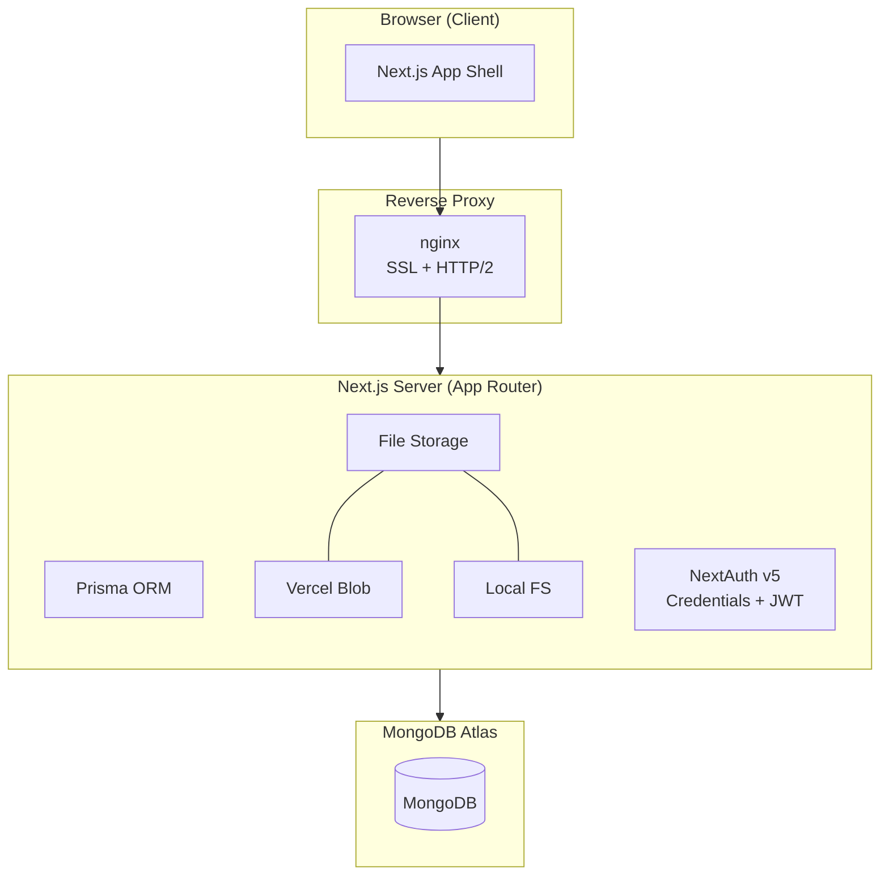

### Authentication Flow

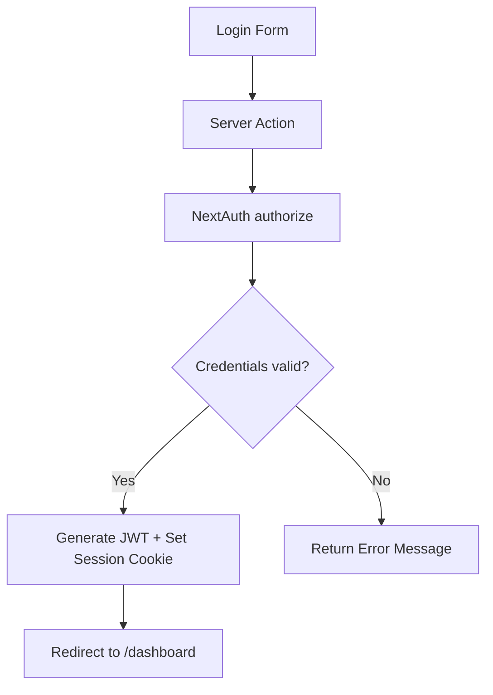

### Database Schema (Prisma)

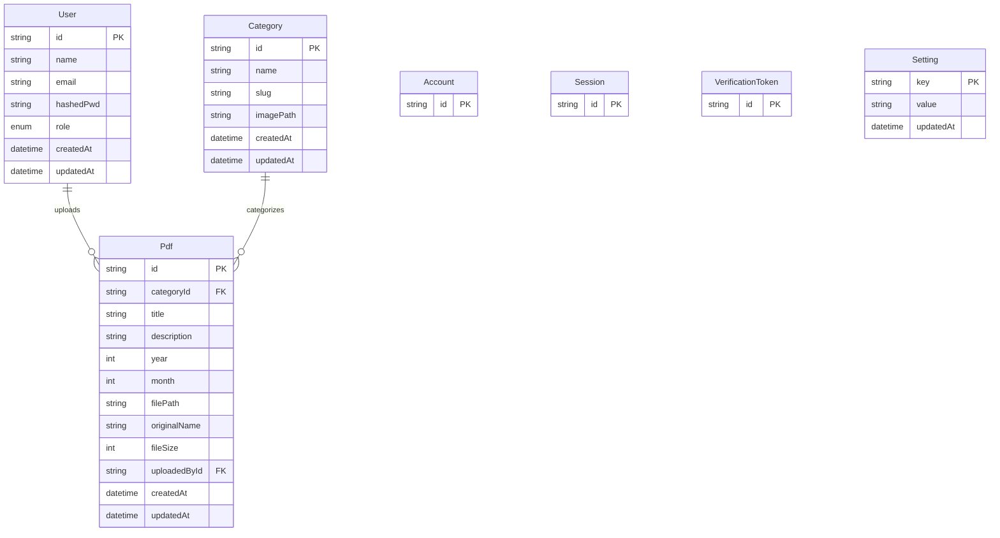

### File Storage Strategy

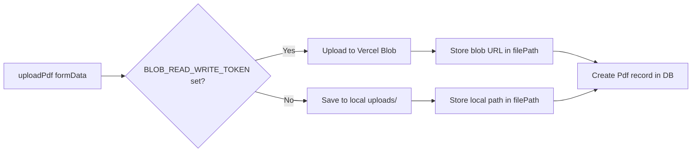

---

## System Flow

### 4.1 PDF Upload Flow

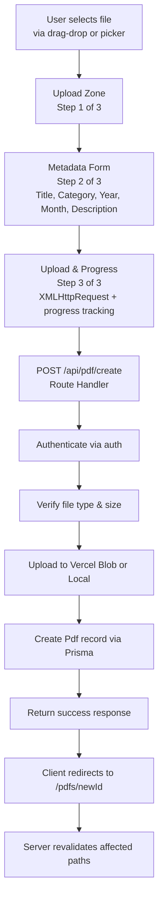

### 4.2 PDF View / Download Flow

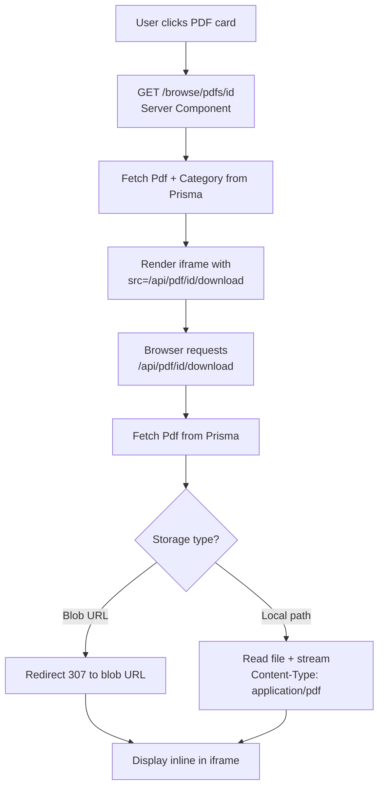

### 4.3 Authentication Flow

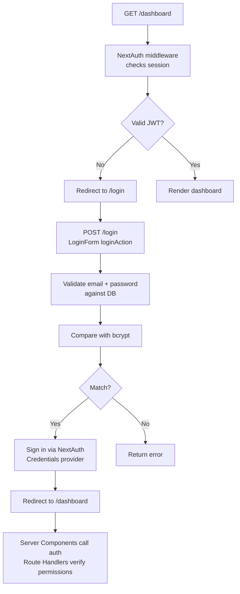

### 4.4 Search Flow

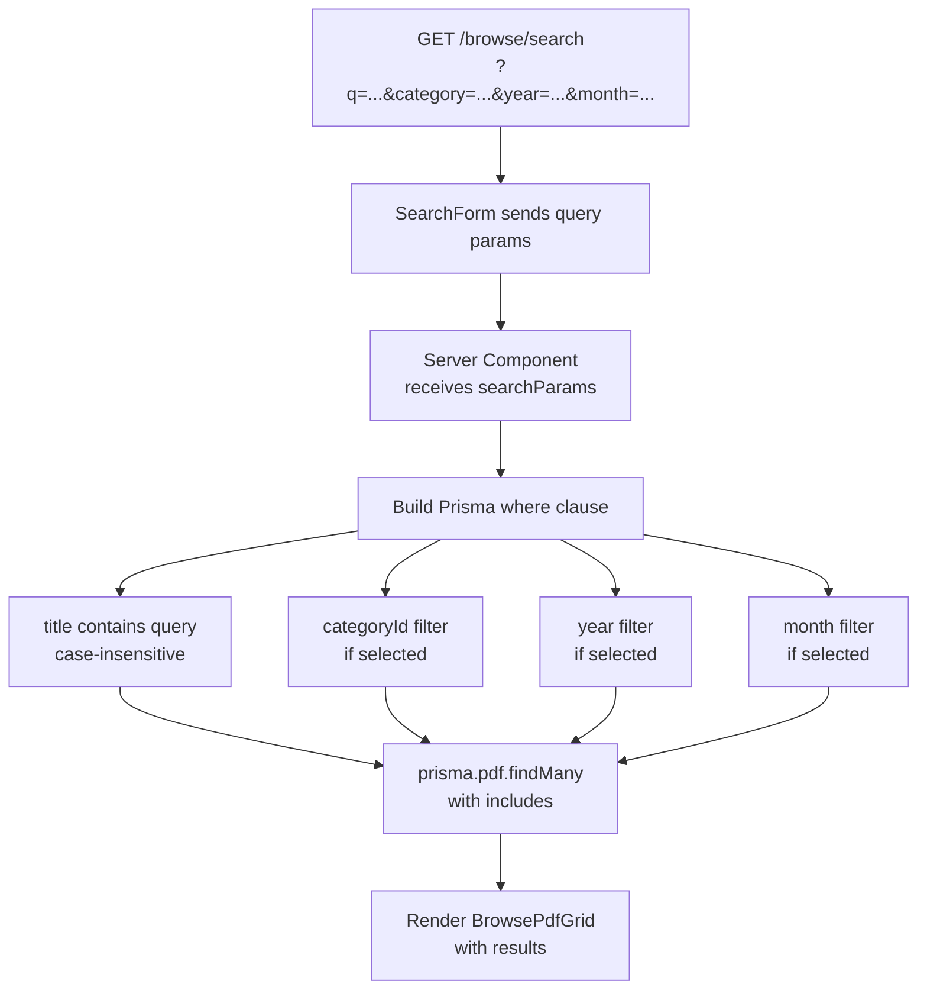

### 4.5 Settings Update Flow

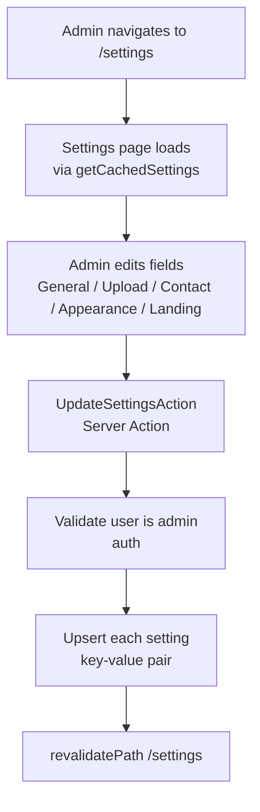

---

## User Flow

### 5.1 Public User (No Login)

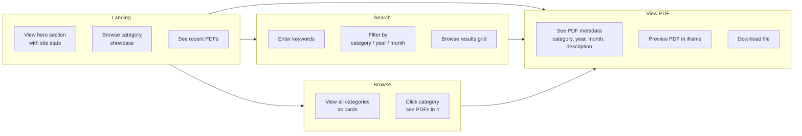

### 5.2 Editor (Logged In)

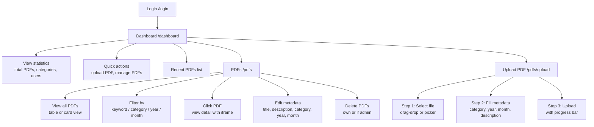

### 5.3 Admin (All Editor Capabilities Plus)

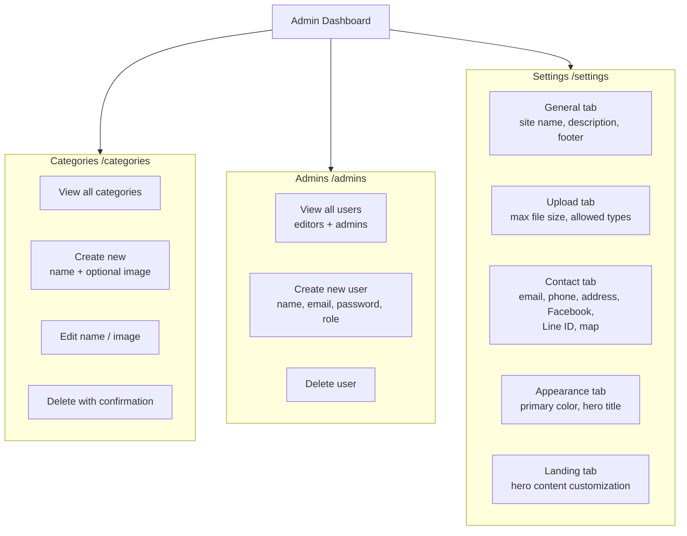

---

## Challenges & Solutions

### 6.1 MongoDB + Prisma Relationship Mapping

MongoDB is document-based with no native JOINs. Prisma with MongoDB provider has limited relationship support compared to SQL providers.

**Solution:** Used embedded references (ObjectId strings) and Prisma's `@map` to handle one-to-many relationships (User to Pdf, Category to Pdf). Queries use Prisma's `include` to eagerly load related documents. All IDs follow MongoDB ObjectId format.

---

### 6.2 Dual File Storage Strategy

The system must work both in development (no Vercel Blob token) and production (with Vercel Blob), requiring transparent fallback.

**Solution:** Abstracted storage behind a single `filePath` field. On download, the system checks whether the path is a blob URL (starts with `https://`) or a local path, then either redirects to the blob URL or streams the file from the local filesystem. Upload logic checks for `BLOB_READ_WRITE_TOKEN` at runtime.

---

### 6.3 Role-Based Access Control Across Multiple Layers

Permissions must be enforced at middleware (route access), Server Components (data visibility), API routes (mutation authorization), and UI (button visibility).

**Solution:** Four-layer approach:

1. **Middleware** (`proxy.ts`) — blocks unauthenticated access to protected routes
2. **Server Actions** — call `auth()` and check `session.user.role` before mutations
3. **API Routes** — same `auth()` check for AJAX endpoints
4. **Client Components** — receive session data as props to conditionally render admin-only UI elements

---

### 6.4 Thai Language Support

Thai characters require specific font loading, and MongoDB's default text search does not natively support Thai word segmentation.

**Solution:** Loaded `Noto_Sans_Thai` via `next/font` with `display: "swap"` and CSS variables. For search, used regex-based matching on title/description fields rather than MongoDB text indexes, since the dataset size is manageable. This avoids Thai word segmentation complexity.

---

### 6.5 File Upload Size Limits

Large PDFs could exceed request body limits (default Next.js 4.5 MB) and cause poor UX during upload.

**Solution:** Implemented chunked upload monitoring via `XMLHttpRequest` with `upload.onprogress` event, displaying a real-time progress bar. Added configurable `maxFileSizeMB` setting (default 50 MB) checked both client-side (before upload) and server-side (during processing).

---

### 6.6 Server / Client Component Boundary

Next.js App Router requires clear separation between Server and Client Components. Directly passing complex objects (like Prisma models with dates) across the boundary causes serialization errors.

**Solution:** All Prisma queries remain in Server Components. Data is passed as plain props (serializable objects). Client components are leaf nodes that handle interactivity (forms, modals, toggles). Server Actions handle mutations and call `revalidatePath()` to keep the UI fresh.

---

### 6.7 State Persistence Across Sessions

User preferences (table vs. card view) should persist across sessions without a database round-trip.

**Solution:** Built a `usePersistedState` hook that syncs state to `localStorage`. The view toggle in the PDF list page uses this hook, so user preference is remembered locally without server involvement.

---

### 6.8 Responsive Layout with Sidebar Navigation

The app shell must work on both desktop (expanded sidebar) and mobile (collapsed/hidden sidebar) while maintaining accessible navigation.

**Solution:** Used shadcn/ui's `Sidebar` component with `@base-ui/react` primitives. Desktop shows a collapsible sidebar with tree navigation. Mobile uses a sheet (slide-over) pattern. The responsive behavior is managed via the `use-mobile` hook that detects viewport width.

---

## Future Roadmap

### Short-Term (Next 3 Months)

- **Full-Text Search** — Integrate MongoDB Atlas Search indexes for Thai-aware full-text search with better ranking and typo tolerance
- **Pagination** — Replace infinite-scroll with cursor-based pagination for large PDF collections (10,000+ records)
- **Bulk Upload** — Allow uploading multiple PDFs at once with batch metadata assignment
- **PDF Thumbnails** — Generate preview thumbnails on upload using a server-side PDF renderer

### Medium-Term (3-6 Months)

- **OAuth Providers** — Add Google/Microsoft login alongside credentials for university staff
- **Activity Log** — Track all user actions (upload, delete, edit) with timestamps and actor info
- **Email Notifications** — Notify editors when new PDFs are uploaded or changes are made
- **CDN Caching** — Cache popular PDFs at the edge via CDN (Vercel Edge or Cloudflare)
- **API Rate Limiting** — Protect public API routes from abuse

### Long-Term (6-12 Months)

- **Elasticsearch Integration** — Replace MongoDB search with dedicated Elasticsearch for advanced full-text search, faceted filtering, and Thai language analyzer support
- **Microservices Split** — Separate file upload service from the main Next.js app for independent scaling
- **Backup Automation** — Automated daily MongoDB dumps and file storage backups to cold storage (S3 Glacier / Backblaze B2)
- **Analytics Dashboard** — Track popular PDFs, search trends, and user engagement metrics
- **API Versioning** — Public REST API with versioning for third-party integrations
- **Mobile App** — Native mobile app (React Native) consuming the same API
- **Automatic PDF Metadata Extraction** — Extract title, author, and publication date from PDF metadata on upload
