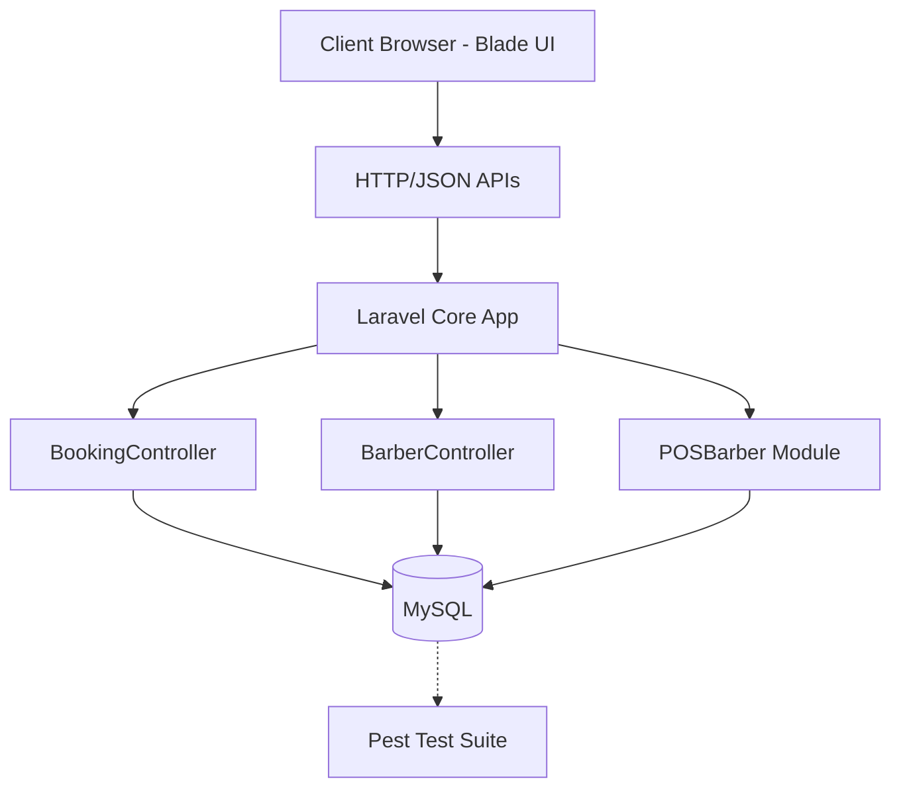
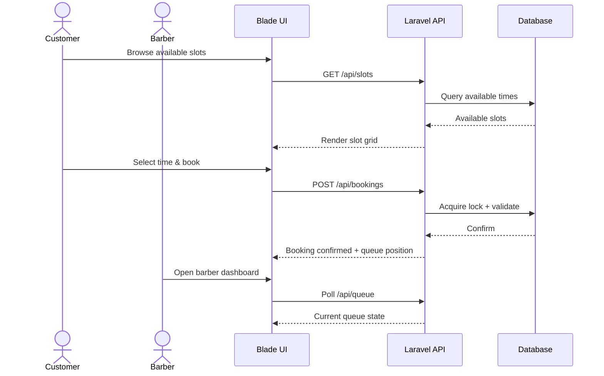

## System Architecture

The system follows a monolithic Laravel architecture with clear separation of concerns. The Blade frontend communicates with the Laravel backend through RESTful JSON APIs. Core business logic is distributed across three controllers, each responsible for a distinct domain: booking, barber management, and point-of-sale.

## System Flow

1. Customer browses available time slots via the Blade UI
2. Booking request is sent as a JSON POST to BookingController
3. Pessimistic lock is acquired on the target time slot row
4. Validation layer runs multi-layered Eloquent rules (no double-booking, shop hours, barber availability)
5. Transaction commits and queue position is assigned
6. Event dispatcher broadcasts the updated queue state
7. Barber dashboard polls the API and reflects changes in real-time

## User Flow

