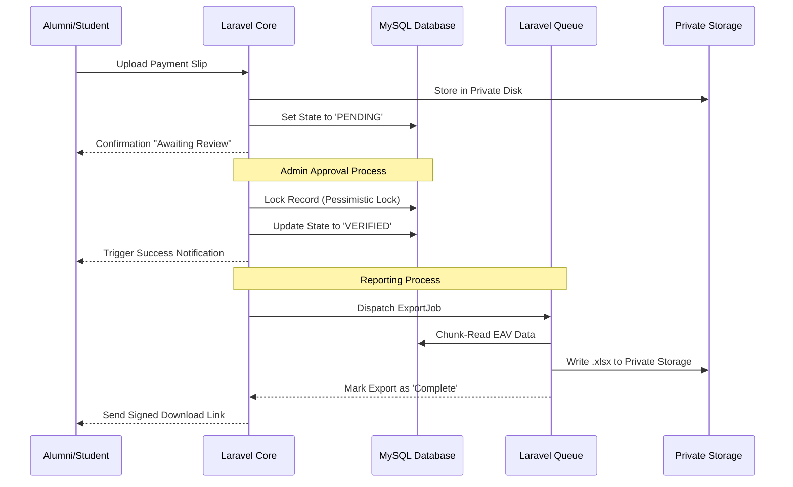

# Graduated System CPRU — Architecture

This document outlines the finalized architectural decisions and implementation patterns for the **CPRU Alumni Regis System**. These patterns are designed to ensure scalability, security, and maintainability as the system grows.

## Project Overview

**Graduated System CPRU** is a digital transformation of the alumni registration and management process for CPRU Rajabhat University. It transitions a previously paper-based workflow into a professional, warmly efficient digital platform.

---

## Tech Stack

- **Backend:** PHP 8.2+, Laravel 12
- **Database:** MySQL (via Eloquent ORM)
- **Frontend:** Bootstrap 5.3.3, Material Dashboard, Vite, Bai Jamjuree Typography
- **Key Integrations:** Maatwebsite/Excel, Intervention/Image, DomPDF, Simple-QRCode

---

## Core Architectural Decisions

### 1. Payment Verification Loop (State Machine)

To ensure the integrity of financial verification, the system implements a formal **State Machine** for payment statuses.

- **States:** `PENDING` -> `UNDER_REVIEW` -> `VERIFIED` | `REJECTED`.
- **Idempotency:** Use of atomic locks (`Cache::lock`) during approval to prevent race conditions.
- **Auditability:** Every state change is recorded in a `payment_logs` table (Who, When, Previous State, New State, Reason).

### 2. Dynamic Form System (Normalized EAV)

To support flexible registration forms without compromising database performance or queryability, the system uses an **Entity-Attribute-Value (EAV)** inspired approach.

- **Schema Structure:**
  - `forms`: General metadata for a registration form.
  - `form_fields`: Definitions of fields (Type, Label, Validation Rules, Order).
  - `form_responses`: A vertical table storing `(response_id, field_id, value)`.
- **Benefit:** Allows admins to add custom fields on-the-fly while maintaining the ability to perform indexed SQL queries for reporting.

### 3. Authorization & Security (RBAC + Policies)

Access control is managed via a combination of **Role-Based Access Control (RBAC)** and **Laravel Policies**.

- **Roles:** Defined tiers (e.g., `SUPER_ADMIN`, `DEPT_ADMIN`, `ALUMNI`).
- **Enforcement:** Logic is centralized in `Policies` rather than controllers.
- **Data Isolation:** Use of **Global Scopes** to ensure `DEPT_ADMIN` can only access records belonging to their specific faculty, preventing IDOR (Insecure Direct Object Reference) attacks.

### 4. High-Volume Reporting (Async Queue Export)

To prevent server timeouts and memory exhaustion during large alumni data exports, the system utilizes **Asynchronous Queue Processing**.

**Workflow:**

1. Admin triggers export -> Job dispatched to queue -> Immediate "Processing" response.
2. **Chunking:** Maatwebsite/Excel processes data in chunks (via `WithChunkReading`) to maintain a low memory footprint.
3. **Delivery:** Upon completion, a notification is sent to the Admin with a **Temporary Signed URL** to download the file.

### 5. Binary Asset Management (Private Storage)

Sensitive documents (payment slips, private IDs) are decoupled from the public web directory to prevent unauthorized access.

- **Storage Strategy:** Files are stored on a **Private Disk** (`storage/app/private`).
- **Access Control:** Files are never served via direct URL. Instead, the system generates a **Temporary Signed URL** that expires shortly after generation.
- **Optimization:** All profile images pass through an `Intervention/Image` pipeline to normalize resolution and compress files into WebP format.

### 6. API Evolution (URI Versioning)

To ensure stability between the backend and frontend (or future mobile apps), the API follows a strict versioning and response contract.

- **Versioning:** All endpoints are prefixed by version (e.g., `/api/v1/alumni`).
- **Response Envelope:** Every response follows a standardized JSON structure.

```json
{
  "success": boolean,
  "data": object|array,
  "message": string,
  "meta": { "version": "1.0" }
}
```

---

## System Sequence Flow



## Design Philosophy

- **Warm Efficiency:** Balancing a professional tool with an approachable university feel.
- **Silk Pink Rarity Rule:** Primary accent color (`#e91e63`) used on 10% or less of the UI to maintain focus.
- **Thai-First:** `Bai Jamjuree` used across all levels for optimal Thai-Latin legibility.

### 7. Database Schema — 24 Tables

```table-group
[
  {
    "name": "activity",
    "cols": 12,
    "description": "Place-based activity scheduling with PDF/file upload support",
    "fields": []
  },
  {
    "name": "banners",
    "cols": 5,
    "description": "Ordered homepage banner rotation",
    "fields": []
  },
  {
    "name": "blogs",
    "cols": 7,
    "description": "Blog posts with pending/approved status workflow",
    "fields": []
  },
  {
    "name": "blog_likes",
    "cols": 4,
    "description": "User likes on blog posts",
    "fields": []
  },
  {
    "name": "cache",
    "cols": 3,
    "description": "Laravel cache key-value store",
    "fields": []
  },
  {
    "name": "cache_locks",
    "cols": 3,
    "description": "Atomic cache lock entries",
    "fields": []
  },
  {
    "name": "cardex",
    "cols": 4,
    "description": "Student academic record cards",
    "fields": []
  },
  {
    "name": "comments",
    "cols": 5,
    "description": "Blog post comments",
    "fields": []
  },
  {
    "name": "daily_logins",
    "cols": 5,
    "description": "Per-user daily login count tracker",
    "fields": []
  },
  {
    "name": "dormitories",
    "cols": 19,
    "description": "Dormitory listings with pricing and images",
    "fields": []
  },
  {
    "name": "dorm_images",
    "cols": 4,
    "description": "Additional dormitory gallery images",
    "fields": []
  },
  {
    "name": "forms",
    "cols": 10,
    "description": "Dynamic EAV form definitions with slugs",
    "fields": []
  },
  {
    "name": "form_responses",
    "cols": 14,
    "description": "Form submissions with payment tracking and file uploads",
    "fields": []
  },
  {
    "name": "import_data",
    "cols": 19,
    "description": "Bulk alumni data import (Thai ID, academics, employment)",
    "fields": [
      { "field": "id", "type": "bigint", "nullable": "No", "default": "" },
      { "field": "thai_id", "type": "varchar(13)", "nullable": "Yes", "default": "NULL" },
      { "field": "student_id", "type": "varchar(9)", "nullable": "No", "default": "" },
      { "field": "title", "type": "varchar(10)", "nullable": "No", "default": "" },
      { "field": "name", "type": "varchar(50)", "nullable": "No", "default": "" },
      { "field": "lastname", "type": "varchar(50)", "nullable": "No", "default": "" },
      { "field": "course", "type": "varchar(50)", "nullable": "Yes", "default": "NULL" },
      { "field": "faculty", "type": "varchar(50)", "nullable": "No", "default": "" },
      { "field": "major", "type": "varchar(50)", "nullable": "Yes", "default": "NULL" },
      { "field": "degree_level", "type": "varchar(50)", "nullable": "No", "default": "" },
      { "field": "generation", "type": "varchar(10)", "nullable": "Yes", "default": "NULL" },
      { "field": "graduation_year", "type": "varchar(10)", "nullable": "Yes", "default": "NULL" },
      { "field": "phone", "type": "varchar(60)", "nullable": "Yes", "default": "NULL" },
      { "field": "job_position", "type": "varchar(80)", "nullable": "Yes", "default": "NULL" },
      { "field": "current_job", "type": "varchar(80)", "nullable": "Yes", "default": "NULL" },
      { "field": "profile_image", "type": "varchar(255)", "nullable": "Yes", "default": "NULL" },
      { "field": "other_files", "type": "varchar(255)", "nullable": "Yes", "default": "NULL" },
      { "field": "created_at", "type": "timestamp", "nullable": "Yes", "default": "NULL" },
      { "field": "updated_at", "type": "timestamp", "nullable": "Yes", "default": "NULL" }
    ]
  },
  {
    "name": "migrations",
    "cols": 3,
    "description": "Laravel migration tracking",
    "fields": []
  },
  {
    "name": "news_files",
    "cols": 5,
    "description": "News article file attachments",
    "fields": []
  },
  {
    "name": "news_posts",
    "cols": 14,
    "description": "News/articles with views counter and publish-date scheduling",
    "fields": []
  },
  {
    "name": "password_reset_tokens",
    "cols": 3,
    "description": "Password reset token storage",
    "fields": []
  },
  {
    "name": "payments",
    "cols": 10,
    "description": "Payment slip verification workflow (5-state ENUM)",
    "fields": []
  },
  {
    "name": "places",
    "cols": 4,
    "description": "Place reference directories",
    "fields": []
  },
  {
    "name": "profiles",
    "cols": 15,
    "description": "Extended user profiles (social links, bio, employment)",
    "fields": []
  },
  {
    "name": "satisfactions",
    "cols": 5,
    "description": "Satisfaction survey scores",
    "fields": []
  },
  {
    "name": "sessions",
    "cols": 6,
    "description": "PHP session storage with serialised payload",
    "fields": []
  },
  {
    "name": "users",
    "cols": 10,
    "description": "Authentication base with RBAC (student_id, usertype)",
    "fields": []
  }
]
```
