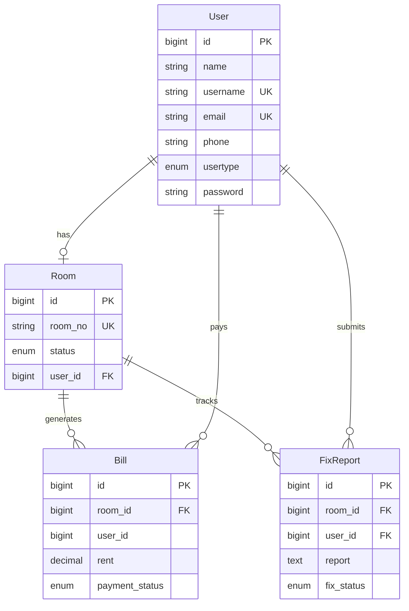

# POS Dormitory Management System

A web-based dormitory management system built with **Laravel 12**. Administrators manage rooms, tenants, bills, and maintenance requests. Residents view their room, bills, and submit fix reports.

---

## Features

### Admin

| Feature               | Description                                                                                                                  |
| --------------------- | ---------------------------------------------------------------------------------------------------------------------------- |
| Dashboard             | Overview with total users, rooms, fix reports; doughnut chart (users/rooms/reports); monthly fix report bar chart (Chart.js) |
| Room Management       | CRUD rooms, add/remove tenants, view room + tenant details                                                                   |
| User Management       | CRUD users with auto-generated usernames (`residents_01`)                                                                    |
| Bills Management      | Create bills for occupied rooms, toggle payment status (Paid/Unpaid)                                                         |
| Fix Report Management | View all reports, update status (Pending / Doing / Done), delete                                                             |

### User (Resident)

| Feature    | Description                                                                             |
| ---------- | --------------------------------------------------------------------------------------- |
| Home       | Summary cards: paid/unpaid bill count, pending fix reports; quick links                 |
| My Room    | View assigned room(s) with status                                                       |
| My Bill    | View personal bills with rent amount and payment status (Thai: "ชำระแล้ว" / "ค้างชำระ") |
| Fix Report | View own reports, submit new fix request                                                |

---

## Tech Stack

| Layer           | Technology                                                      |
| --------------- | --------------------------------------------------------------- |
| Backend         | PHP 8.2+, Laravel 12                                            |
| Database        | MySQL (default, session/cache/queue also use DB)                |
| Frontend (main) | Bootstrap 5.3, jQuery 3.7, Chart.js 4.4, SweetAlert2 11         |
| Frontend (auth) | Tailwind CSS + Alpine.js (Laravel Breeze scaffold)              |
| Icons           | Font Awesome 6, Bootstrap Icons                                 |
| Fonts           | Google Fonts — K2D (primary), Kanit, Mitr, Prompt, Sarabun      |
| Build           | Vite, PostCSS                                                   |
| Auth            | Laravel Breeze 2.3 (session-based), custom CheckRole middleware |

---

## Requirements

- PHP ^8.2
- MySQL 5.7+
- Composer
- Node.js 18+ & npm
- XAMPP / Laragon / Docker

---

## Installation (XAMPP)

### 1. Clone & place project

```bash
# Place the project folder under C:\xampp\htdocs\pos.domitory.local
```

### 2. Start services

Open XAMPP Control Panel → Start **Apache** and **MySQL**.

### 3. Create database

Open http://localhost/phpmyadmin → New → Database name: `pos.domitory.local`

### 4. Install PHP dependencies

```bash
cd C:\xampp\htdocs\pos.domitory.local
composer install
```

### 5. Install & build frontend assets

```bash
npm install
npm run build
```

### 6. Environment configuration

```bash
copy .env.example .env
```

Edit `.env` and set:

```
APP_NAME="POS Dormitory"
APP_URL=http://localhost:8000

DB_CONNECTION=mysql
DB_HOST=127.0.0.1
DB_PORT=3306
DB_DATABASE=pos.domitory.local
DB_USERNAME=root
DB_PASSWORD=
```

### 7. Generate app key

```bash
php artisan key:generate
```

### 8. Run migrations

> **Note:** This creates only the default Laravel tables (users, sessions, cache, jobs). The `room`, `bill`, and `fix_reports` tables have **no migration** — you must create them manually.

Run the stock migrations:

```bash
php artisan migrate
```

Then execute the following SQL in phpMyAdmin:

```sql
CREATE TABLE `room` (
  `id`         BIGINT UNSIGNED AUTO_INCREMENT PRIMARY KEY,
  `room_no`    VARCHAR(255) NOT NULL,
  `status`     VARCHAR(255) NOT NULL DEFAULT 'Empty',
  `user_id`    BIGINT UNSIGNED DEFAULT NULL,
  `created_at` TIMESTAMP NULL,
  `updated_at` TIMESTAMP NULL,
  CONSTRAINT `fk_room_user` FOREIGN KEY (`user_id`) REFERENCES `users`(`id`) ON DELETE SET NULL
);

CREATE TABLE `bill` (
  `id`             BIGINT UNSIGNED AUTO_INCREMENT PRIMARY KEY,
  `room_id`        BIGINT UNSIGNED NOT NULL,
  `user_id`        BIGINT UNSIGNED NOT NULL,
  `rent`           DECIMAL(10,2) NOT NULL,
  `payment_status` VARCHAR(255) NOT NULL DEFAULT 'Unpaid',
  `created_at`     TIMESTAMP NULL,
  `updated_at`     TIMESTAMP NULL,
  CONSTRAINT `fk_bill_room` FOREIGN KEY (`room_id`) REFERENCES `room`(`id`) ON DELETE CASCADE
);

CREATE TABLE `fix_reports` (
  `id`         BIGINT UNSIGNED AUTO_INCREMENT PRIMARY KEY,
  `room_id`    BIGINT UNSIGNED NOT NULL,
  `user_id`    BIGINT UNSIGNED NOT NULL,
  `report`     TEXT NOT NULL,
  `fix_status` VARCHAR(255) NOT NULL DEFAULT 'Pending',
  `created_at` TIMESTAMP NULL,
  `updated_at` TIMESTAMP NULL,
  CONSTRAINT `fk_fixreport_room` FOREIGN KEY (`room_id`) REFERENCES `room`(`id`) ON DELETE CASCADE,
  CONSTRAINT `fk_fixreport_user` FOREIGN KEY (`user_id`) REFERENCES `users`(`id`) ON DELETE CASCADE
);
```

### 9. Start development server

```bash
php artisan serve
```

Visit **http://localhost:8000** in your browser.

### 10. Create admin account

1. Register at http://localhost:8000/register
2. Open phpMyAdmin → table `users` → set `usertype` to `admin` for your account
3. Logout and login again — you will be redirected to `/admin/dashboard`

---

## Directory Structure

```bash
pos.domitory.local/
├── app/
│   ├── Http/
│   │   ├── Controllers/
│   │   │   ├── Api/
│   │   │   │   ├── BillsController.php
│   │   │   │   ├── DashboardController.php
│   │   │   │   ├── FixReportController.php
│   │   │   │   ├── HomeController.php
│   │   │   │   ├── RoomController.php
│   │   │   │   └── UsersController.php
│   │   │   ├── Auth/              # Laravel Breeze auth controllers
│   │   │   └── ProfileController.php
│   │   ├── Middleware/
│   │   │   └── CheckRole.php       # Role-based access (admin/user)
│   │   └── Requests/
│   ├── Models/
│   │   ├── Bill.php               # table: bill
│   │   ├── FixReport.php          # table: fix_reports
│   │   ├── Room.php               # table: room
│   │   └── User.php               # table: users
│   └── Providers/
├── bootstrap/
│   └── app.php                     # Middleware alias: 'role'
├── config/
├── database/
│   ├── migrations/                 # Laravel stock tables only
│   └── seeders/
├── resources/views/
│   ├── layouts/
│   │   ├── master.blade.php        # Main layout (Bootstrap 5 + jQuery)
│   │   ├── aside.blade.php         # Sidebar navigation
│   │   ├── header.blade.php        # Top bar with user dropdown
│   │   └── app.blade.php           # Auth layout (Tailwind)
│   └── pages/
│       ├── admin/
│       │   ├── dashboard.blade.php
│       │   └── feature/
│       │       ├── room.blade.php
│       │       ├── user.blade.php
│       │       ├── bills.blade.php
│       │       └── fixReport.blade.php
│       └── user/
│           ├── home.blade.php
│           └── feature/
│               ├── room.blade.php
│               ├── bills.blade.php
│               └── fixReport.blade.php
├── routes/
│   ├── web.php                     # Web routes
│   ├── api.php                     # API routes (POST-only)
│   └── auth.php                    # Breeze auth routes
└── docs/
    └── API.mdx                     # Full API reference
```

---

## Database Schema

### Core Tables

| Table         | Description                   | Key Columns                                                                       |
| ------------- | ----------------------------- | --------------------------------------------------------------------------------- |
| `users`       | All users (admin + residents) | `id`, `name`, `username`, `email`, `phone`, `usertype` (admin/user), `password`   |
| `room`        | Dormitory rooms               | `id`, `room_no`, `status` (Empty/Full), `user_id` (FK → users)                    |
| `bill`        | Rent bills                    | `id`, `room_id` (FK), `user_id`, `rent`, `payment_status` (Paid/Unpaid)           |
| `fix_reports` | Maintenance requests          | `id`, `room_id` (FK), `user_id` (FK), `report`, `fix_status` (Pending/Doing/Done) |

### Relationships

```
users  (1) ──── (0..1)  room         — one resident per room
room   (1) ──── (0..*)  bill          — a room can have many bills
room   (1) ──── (0..*)  fix_reports   — a room can have many fix reports
users  (1) ──── (0..*)  fix_reports   — a user can submit many reports
users  (1) ──── (0..*)  bill          — a user can have many bills
```

### Eloquent Models

| Model       | Table         | Fillable                                         | Relations                               |
| ----------- | ------------- | ------------------------------------------------ | --------------------------------------- |
| `User`      | `users`       | name, username, email, phone, usertype, password | (none defined)                          |
| `Room`      | `room`        | room_no, status, user_id                         | `belongsTo(User)`, `hasMany(FixReport)` |
| `Bill`      | `bill`        | room_id, user_id, rent, payment_status           | `belongsTo(Room)`                       |
| `FixReport` | `fix_reports` | room_id, user_id, report, fix_status             | `belongsTo(Room)`, `belongsTo(User)`    |

### Entity Relationship Diagram



---

## Auth & Roles

- **Auth**: Laravel Breeze (session-based via `web` guard)
- **Role column**: `users.usertype` — values: `admin` | `user`
- **Middleware**: `CheckRole` registered as alias `role` in `bootstrap/app.php`
- **Route protection**:
  - `route::middleware(['auth', 'role:admin'])` → `/admin/*`
  - `route::middleware(['auth', 'role:user'])` → `/user/*`
- On login, users are redirected based on `usertype` (admin → dashboard, user → home)

---

## Routes

### Web Routes

| Method           | URI                      | Middleware       | Description                 |
| ---------------- | ------------------------ | ---------------- | --------------------------- |
| GET              | `/`                      | guest            | Welcome page                |
| GET/POST         | `/login`                 | guest            | Login                       |
| GET/POST         | `/register`              | guest            | Register                    |
| GET              | `/admin/dashboard`       | auth, role:admin | Admin dashboard             |
| GET              | `/admin/room_management` | auth, role:admin | Admin room management       |
| GET              | `/admin/user_management` | auth, role:admin | Admin user management       |
| GET              | `/admin/bills`           | auth, role:admin | Admin bills management      |
| GET              | `/admin/fix_report`      | auth, role:admin | Admin fix report management |
| GET              | `/user/home`             | auth, role:user  | User home page              |
| GET              | `/user/room`             | auth, role:user  | User room view              |
| GET              | `/user/bills`            | auth, role:user  | User bills view             |
| GET              | `/user/fix_report`       | auth, role:user  | User fix report view        |
| GET/PATCH/DELETE | `/profile`               | auth             | Profile management          |

### API Routes

| Prefix             | Endpoints                                                       | Controller            |
| ------------------ | --------------------------------------------------------------- | --------------------- |
| `/api/room/*`      | list, add, edit, delete, summary, addTenant, removeTenant, view | `RoomController`      |
| `/api/user/*`      | list, add, edit, delete, view                                   | `UsersController`     |
| `/api/bills/*`     | roomHasTenant, list, add, changeStatus                          | `BillsController`     |
| `/api/fixReport/*` | list, edit, update, delete                                      | `FixReportController` |
| `/api/home/*`      | summary, my-bills, my-room, my-fix-report, fix-report/create    | `HomeController`      |
| `/api/dashboard`   | index, fix-report/summary                                       | `DashboardController` |

---

## Available Scripts

```bash
# Start dev server, queue worker, and Vite concurrently
composer run dev

# Run tests
composer run test

# Full setup (composer install, .env, key:generate, migrate, npm install & build)
composer run setup
```

---

## API Response Format

All API endpoints return JSON in this structure:

```json
{
  "status": "200",
  "message": "success",
  "data": {},
  "error": ""
}
```

| Status Code     | Meaning                         |
| --------------- | ------------------------------- |
| `"200"` / `200` | Success                         |
| `"400"` / `400` | Validation error or bad request |
| `"404"` / `404` | Resource not found              |
| `"500"` / `500` | Server error                    |

---

## Notes & Caveats

1. **Missing migrations**: Tables `room`, `bill`, and `fix_reports` are not defined in any migration file. They must be created manually or via a custom migration.
2. **No auth on API routes**: The API routes (`routes/api.php`) have no auth middleware. Access control relies on CSRF tokens and session-based page access.
3. **Bill → User relation**: The `Bill` model only defines `belongsTo(Room)` — queries for user bills work via the `user_id` column directly in controllers.
4. **Username generation**: New users created via `/api/user/add` get auto-generated usernames (`residents_01`, `residents_02`, ...).
5. **Debug scripts**: `debug_login.php` and `debug_users.php` are available for troubleshooting auth issues.

# API Reference — POS Dormitory Management System

Base URL: `http://pos.domitory.local/api`

Method: **POST** for all endpoints

Content-Type: `application/x-www-form-urlencoded`

CSRF: A valid `X-CSRF-TOKEN` header is required (auto-set by jQuery on pages that extend the master layout).

---

## Response Format

All endpoints return JSON:

```json
{
  "status": "200",
  "message": "success",
  "data": {},
  "error": ""
}
```

### Status Codes

| Value           | Meaning                                              |
| --------------- | ---------------------------------------------------- |
| `"200"` / `200` | Success — data payload is in `data`                  |
| `"400"` / `400` | Validation error or bad request — details in `error` |
| `"404"` / `404` | Resource not found                                   |
| `"500"` / `500` | Server exception — message in `error`                |

> Note: Some controllers return status as a **string** (`"200"`), others as an **integer** (`200`). Check each endpoint's response examples.

---

## Room API

### `POST /api/room/list`

Get all rooms with tenant names.

**Parameters:** None

**Response:**

```json
{
  "status": "200",
  "message": "success",
  "data": [
    {
      "id": 1,
      "roomNumber": "A101",
      "name": "John Doe",
      "status": "Full"
    },
    {
      "id": 2,
      "roomNumber": "A102",
      "name": "-",
      "status": "Empty"
    }
  ]
}
```

---

### `POST /api/room/add`

Create a new room.

**Parameters:**

| Name         | Type   | Required | Description                  |
| ------------ | ------ | -------- | ---------------------------- |
| `roomNumber` | string | yes      | Room number (must be unique) |

**Success Response (200):**

```json
{
  "status": "200",
  "message": "Room added successfully",
  "data": {
    "room_no": "A103",
    "status": "Empty",
    "id": 3
  }
}
```

**Error — Duplicate room:**

```json
{
  "status": "400",
  "message": "failed",
  "error": "Room already exists"
}
```

---

### `POST /api/room/edit`

Update a room number.

**Parameters:**

| Name         | Type   | Required | Description     |
| ------------ | ------ | -------- | --------------- |
| `id`         | int    | yes      | Room ID         |
| `roomNumber` | string | yes      | New room number |

**Error cases:**

- Room not found: `"error": "Room not found"`
- Duplicate room number: `"error": "Room already exists"`
- Same number as current: `"error": "Room number is same"`

---

### `POST /api/room/delete`

Delete a room. Only works if room status is `Empty`.

**Parameters:**

| Name | Type | Required | Description |
| ---- | ---- | -------- | ----------- |
| `id` | int  | yes      | Room ID     |

**Error — Room is occupied:**

```json
{
  "status": "400",
  "message": "failed",
  "error": "Room is full"
}
```

---

### `POST /api/room/summary`

Get total room and tenant counts.

**Parameters:** None

**Response:**

```json
{
  "status": "200",
  "message": "success",
  "data": {
    "total_room": 10,
    "total_tenant": 6
  }
}
```

---

### `POST /api/room/addTenant`

Assign a user to a room.

**Parameters:**

| Name         | Type   | Required | Description                           |
| ------------ | ------ | -------- | ------------------------------------- |
| `roomNumber` | string | yes      | Room number                           |
| `userID`     | int    | yes      | User ID (must exist in `users` table) |

**Constraints:**

- Room must not already be `Full`
- Room must not already have a user assigned (`user_id` must be null)

**Error — Room already occupied:**

```json
{
  "status": "400",
  "message": "failed",
  "error": "Room already has a user"
}
```

---

### `POST /api/room/removeTenant`

Remove a user from a room. Resets status to `Empty` and clears `user_id`.

**Parameters:**

| Name         | Type   | Required | Description |
| ------------ | ------ | -------- | ----------- |
| `roomNumber` | string | yes      | Room number |

---

### `POST /api/room/view`

Get detailed room info including tenant details.

**Parameters:**

| Name | Type | Required | Description |
| ---- | ---- | -------- | ----------- |
| `id` | int  | yes      | Room ID     |

**Response (room has tenant):**

```json
{
  "status": 200,
  "message": "success",
  "data": {
    "room": {
      "id": 1,
      "room_no": "A101",
      "status": "Full",
      "user_id": 5
    },
    "tenant": {
      "id": 5,
      "name": "John Doe",
      "email": "john@example.com",
      "phone": "0812345678"
    }
  }
}
```

**Response (room is empty):**

```json
{
  "status": 200,
  "message": "success",
  "data": {
    "room": {
      "id": 2,
      "room_no": "A102",
      "status": "Empty",
      "user_id": null
    },
    "tenant": null
  }
}
```

---

## User API

### `POST /api/user/list`

Get all users.

**Parameters:** None

**Response:**

```json
{
  "status": "200",
  "message": "success",
  "data": [
    {
      "id": 1,
      "name": "Admin",
      "username": "admin",
      "email": "admin@example.com",
      "phone": "0812345678",
      "usertype": "admin",
      "created_at": "2026-01-01T00:00:00.000000Z",
      "updated_at": "2026-01-01T00:00:00.000000Z"
    }
  ]
}
```

---

### `POST /api/user/add`

Create a new user. Username is auto-generated as `residents_XX` (incremental).

**Parameters:**

| Name       | Type   | Required | Constraints                 |
| ---------- | ------ | -------- | --------------------------- |
| `name`     | string | yes      | max 255                     |
| `email`    | string | yes      | must be valid email, unique |
| `phone`    | string | yes      | max 255, unique             |
| `password` | string | yes      | min 8 characters            |

> Note: The admin form also sends `usertype`, but the controller **always** sets `usertype = 'user'` regardless of the input value. To create an admin account, manually update the `usertype` column in the database.

**Success Response:**

```json
{
  "status": "200",
  "message": "success",
  "data": {
    "name": "Jane Doe",
    "username": "residents_03",
    "email": "jane@example.com",
    "phone": "0898765432",
    "usertype": "user",
    "id": 6
  }
}
```

**Error — Validation:**

```json
{
  "status": "400",
  "message": "failed",
  "error": {
    "email": ["The email has already been taken."],
    "phone": ["The phone has already been taken."]
  }
}
```

---

### `POST /api/user/edit`

Update an existing user.

**Parameters:**

| Name       | Type   | Required      | Description                         |
| ---------- | ------ | ------------- | ----------------------------------- |
| `id`       | int    | yes           | User ID                             |
| `name`     | string | yes           |                                     |
| `username` | string | yes           |                                     |
| `email`    | string | yes           |                                     |
| `password` | string | no (but sent) | Will be bcrypt-hashed even if empty |
| `usertype` | string | yes           | `"admin"` or `"user"`               |

> **Known issue:** This controller has **no validation** — all fields are saved as-is. Empty passwords will be bcrypt-hashed (creating a valid but insecure hash).

---

### `POST /api/user/delete`

Delete a user.

**Parameters:**

| Name | Type | Required |
| ---- | ---- | -------- |
| `id` | int  | yes      |

---

### `POST /api/user/view`

Get a single user's details.

**Parameters:**

| Name | Type | Required |
| ---- | ---- | -------- |
| `id` | int  | yes      |

**Response:**

```json
{
  "status": "200",
  "message": "success",
  "data": {
    "id": 1,
    "name": "Admin",
    "username": "admin",
    "email": "admin@example.com",
    "phone": "0812345678",
    "usertype": "admin",
    "created_at": "2026-01-01T00:00:00.000000Z",
    "updated_at": "2026-01-01T00:00:00.000000Z"
  }
}
```

---

## Bills API

### `POST /api/bills/roomHasTenant`

Get all rooms that currently have a tenant assigned (for bill creation dropdown).

**Parameters:** None

**Response:**

```json
{
  "status": 200,
  "message": "success",
  "data": [
    {
      "roomID": 1,
      "roomNo": "A101",
      "status": "Full",
      "userID": 5,
      "name": "John Doe",
      "phone": "0812345678"
    }
  ]
}
```

---

### `POST /api/bills/list`

Get all bills with room and user info.

**Parameters:** None

**Response:**

```json
{
  "status": 200,
  "message": "success",
  "data": [
    {
      "billID": 1,
      "roomID": 1,
      "roomNo": "A101",
      "userID": 5,
      "name": "John Doe",
      "phone": "0812345678",
      "rent": "3500.00",
      "paymentStatus": "Unpaid",
      "createdAt": "2026-01-15 10:30:00",
      "updatedAt": "2026-01-15 10:30:00"
    }
  ]
}
```

---

### `POST /api/bills/add`

Create a new bill. Default status is `Unpaid`.

**Parameters:**

| Name     | Type    | Required | Description                  |
| -------- | ------- | -------- | ---------------------------- |
| `roomID` | int     | yes      | Room ID (must have a tenant) |
| `rent`   | numeric | yes      | Rent amount                  |
| `userID` | int     | yes      | User (tenant) ID             |

---

### `POST /api/bills/changeStatus`

Toggle a bill's payment status.

**Parameters:**

| Name            | Type   | Required | Constraints                    |
| --------------- | ------ | -------- | ------------------------------ |
| `billID`        | int    | yes      |                                |
| `paymentStatus` | string | yes      | Must be `"Paid"` or `"Unpaid"` |

---

## Fix Report API

### `POST /api/fixReport/list`

Get all fix reports with room and user info.

**Parameters:** None

**Response:**

```json
{
  "status": 200,
  "message": "success",
  "data": [
    {
      "id": 1,
      "room": "A101",
      "user": "John Doe",
      "report": "Air conditioner not cooling",
      "fix_status": "Pending",
      "created_at": "15/01/2026 10:30"
    }
  ]
}
```

---

### `POST /api/fixReport/edit`

Get a single fix report for editing.

**Parameters:**

| Name | Type | Required |
| ---- | ---- | -------- |
| `id` | int  | yes      |

**Response:**

```json
{
  "status": 200,
  "data": {
    "id": 1,
    "room": "A101",
    "user": "John Doe",
    "report": "Air conditioner not cooling",
    "fix_status": "Pending"
  }
}
```

---

### `POST /api/fixReport/update`

Update a fix report's status.

**Parameters:**

| Name         | Type   | Required | Description                              |
| ------------ | ------ | -------- | ---------------------------------------- |
| `id`         | int    | yes      | Fix report ID                            |
| `fix_status` | string | yes      | One of: `"Pending"`, `"Doing"`, `"Done"` |
| `report`     | string | no       | Sent but unused in controller            |

> Note: The admin form sends `report` but the controller only updates `fix_status`.

---

### `POST /api/fixReport/delete`

Delete a fix report.

**Parameters:**

| Name | Type | Required |
| ---- | ---- | -------- |
| `id` | int  | yes      |

---

## Home API (User-facing)

### `POST /api/home/summary`

Get a user's summary: rooms, bills, and pending fix reports.

**Parameters:**

| Name     | Type | Required | Description         |
| -------- | ---- | -------- | ------------------- |
| `userID` | int  | yes      | Logged-in user's ID |

**Response:**

```json
{
  "status": 200,
  "message": "success",
  "data": {
    "rooms": [
      {
        "id": 1,
        "room_no": "A101",
        "status": "Full",
        "user_id": 5
      }
    ],
    "bills": [
      {
        "id": 1,
        "room_id": 1,
        "user_id": 5,
        "rent": "3500.00",
        "payment_status": "Unpaid",
        "created_at": "2026-01-15T10:30:00.000000Z",
        "updated_at": "2026-01-15T10:30:00.000000Z"
      }
    ],
    "fixReports": [
      {
        "id": 1,
        "room_id": 1,
        "user_id": 5,
        "report": "Air conditioner not cooling",
        "fix_status": "Pending",
        "created_at": "2026-01-15T10:30:00.000000Z",
        "updated_at": "2026-01-15T10:30:00.000000Z"
      }
    ]
  }
}
```

---

### `POST /api/home/my-bills`

Get a user's bills with room info, ordered newest first.

**Parameters:**

| Name     | Type | Required |
| -------- | ---- | -------- |
| `userID` | int  | yes      |

**Response:**

```json
{
  "status": 200,
  "message": "success",
  "data": [
    {
      "id": 1,
      "room": "A101",
      "rent": "3500.00",
      "status": "Unpaid",
      "date": "15/01/2026"
    }
  ]
}
```

---

### `POST /api/home/my-room`

Get a user's assigned rooms and personal info.

**Parameters:**

| Name     | Type | Required |
| -------- | ---- | -------- |
| `userID` | int  | yes      |

**Response:**

```json
{
  "status": 200,
  "message": "success",
  "data": {
    "user": {
      "name": "John Doe",
      "email": "john@example.com",
      "phone": "0812345678"
    },
    "rooms": [
      {
        "room_no": "A101",
        "status": "Full"
      }
    ]
  }
}
```

---

### `POST /api/home/my-fix-report`

Get a user's fix reports along with their room and user info.

**Parameters:**

| Name     | Type | Required |
| -------- | ---- | -------- |
| `userID` | int  | yes      |

**Response:**

```json
{
  "status": 200,
  "message": "success",
  "data": {
    "user": {
      "name": "John Doe",
      "email": "john@example.com",
      "phone": "0812345678"
    },
    "fixReports": [
      {
        "room_id": 1,
        "fix_status": "Pending",
        "report": "Air conditioner not cooling"
      }
    ],
    "room": {
      "room_no": "A101",
      "id": 1
    }
  }
}
```

---

### `POST /api/home/fix-report/create`

Submit a new fix report.

**Parameters:**

| Name     | Type   | Required | Description                |
| -------- | ------ | -------- | -------------------------- |
| `userID` | int    | yes      | User submitting the report |
| `roomID` | int    | yes      | Room ID                    |
| `report` | string | yes      | Description of the issue   |

The new report is created with `fix_status = "Pending"`.

---

## Dashboard API

### `POST /api/dashboard`

Get aggregate counts for the admin dashboard.

**Parameters:** None

**Response:**

```json
{
  "status": "success",
  "message": "Dashboard data",
  "data": {
    "total_users": 25,
    "total_rooms": 10,
    "total_fix_reports": 8
  }
}
```

---

### `POST /api/dashboard/fix-report/summary`

Get monthly fix report counts for the chart (12-month array, Jan = index 0).

**Parameters:** None

**Response:**

```json
{
  "status": "success",
  "data": {
    "monthly": [2, 0, 1, 3, 0, 0, 0, 0, 0, 0, 0, 0]
  }
}
```

---

## Error Reference

| Scenario                | HTTP Status | `status` field   | `error` field                     |
| ----------------------- | ----------- | ---------------- | --------------------------------- |
| Success                 | 200         | `"200"` or `200` | —                                 |
| Validation failure      | 200         | `"400"` or `400` | Validation error object or string |
| Resource not found      | 200         | `"404"` or `404` | Descriptive message               |
| Business rule violation | 200         | `"400"` or `400` | e.g. "Room is full"               |
| Server exception        | 200         | `"500"` or `500` | Exception message                 |
