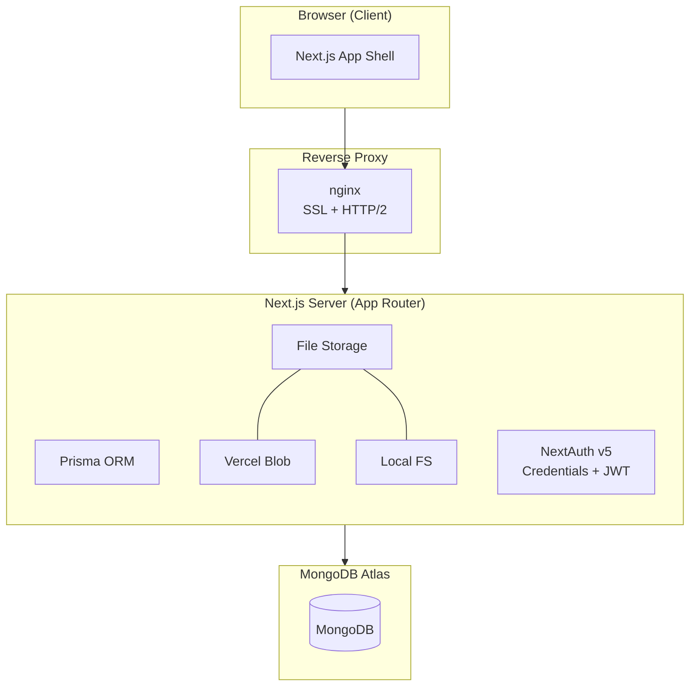
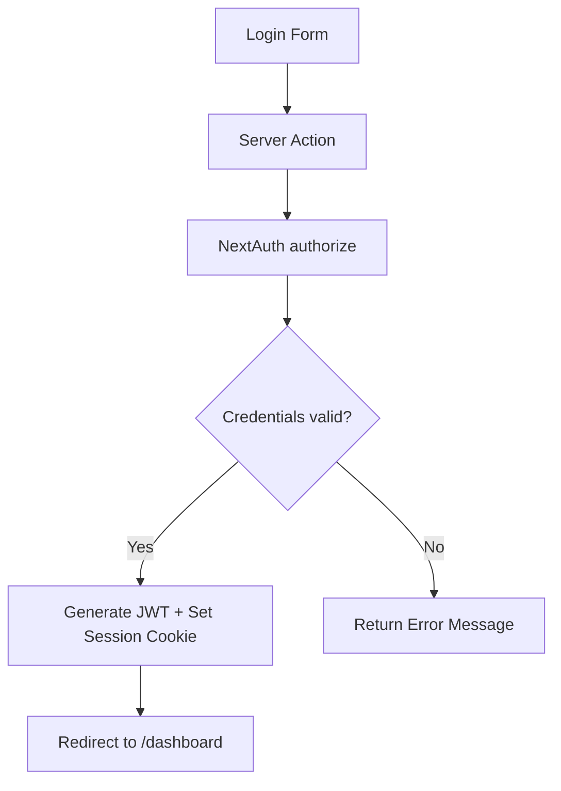
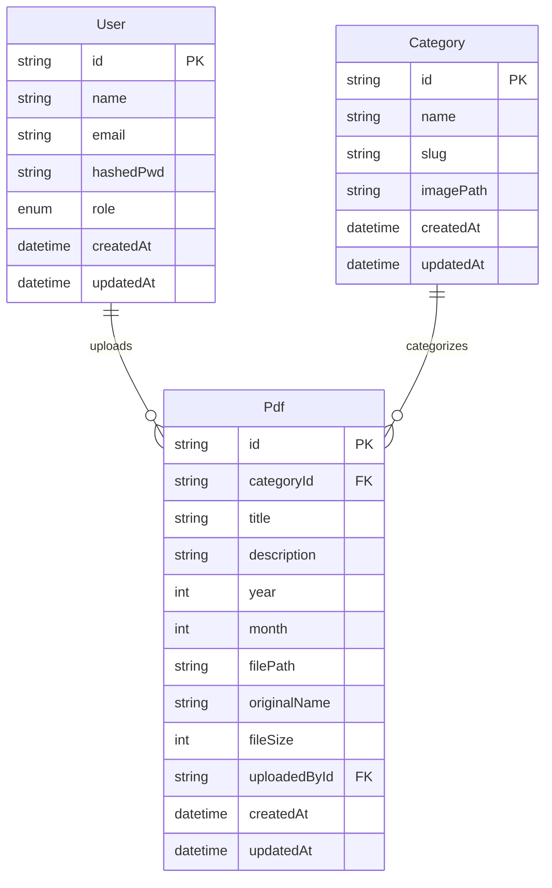
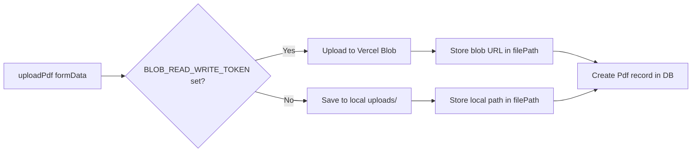
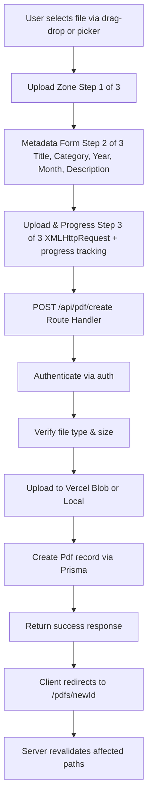
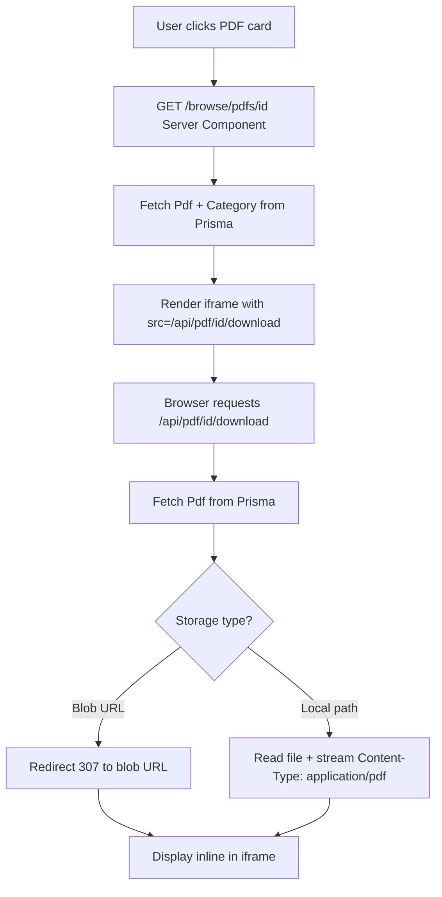
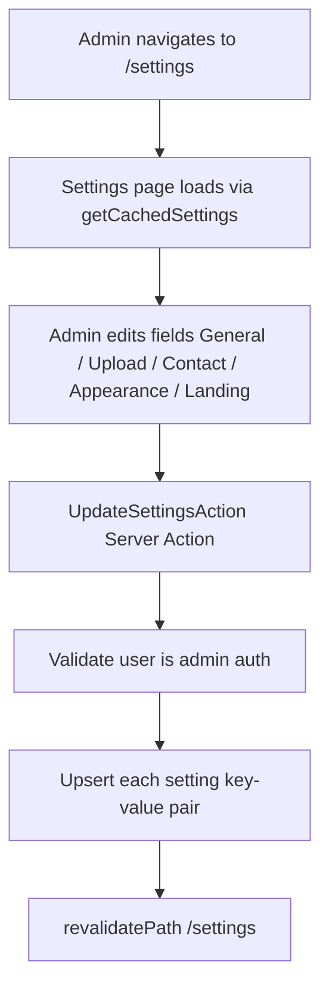

# University Database System — Architecture

A production-grade PDF management platform purpose-built for university academic document workflows. This document covers system architecture, data flow, user roles, and design decisions.

---

## Project Architecture

### High-Level Structure

```cmd
university-database-system/
├── prisma/             # Database schema + seed
├── public/             # Static assets
├── src/
│   ├── app/            # Next.js App Router (pages + API routes)
│   ├── components/     # Reusable UI components
│   ├── hooks/          # Custom React hooks
│   └── lib/            # Server Actions, auth config, utilities
├── uploads/            # Local file storage (fallback)
├── nginx/              # Reverse proxy + SSL config
├── docker-compose.yml  # Multi-service orchestration
├── Dockerfile          # App container
└── components.json     # shadcn/ui config
```

### Route Grouping

| Group | Path | Auth Required | Description |
|---|---|---|---|
| `(app)/` | `/dashboard`, `/pdfs`, `/categories`, `/admins`, `/settings` | Yes (Editor/Admin) | Authenticated app shell with sidebar + topbar |
| `(auth)/` | `/login` | No | Login page (redirects to dashboard if already authenticated) |
| `browse/` | `/browse/categories`, `/browse/pdfs/[id]`, `/browse/search` | No | Public-facing browse and search |
| `api/` | `/api/auth/*`, `/api/pdf/*`, `/api/category/*` | Mixed | Route handlers for AJAX calls and file serving |

### Data-Fetching Strategy (Hybrid)

The project uses three complementary patterns:

- **Server Components (RSC)** — Direct `prisma` calls during server-side rendering for initial page loads. No HTTP round-trip.
- **Server Actions** — `"use server"` functions for mutations (create, update, delete). Called from client components via `formAction` or `useActionState`. Mutations call `revalidatePath()` to refresh cached pages.
- **Fetch API (Route Handlers)** — Traditional `fetch()` calls to `/api/*` routes for non-form interactions (delete confirmation, modal data loading, file downloads).

### Route Protection

Middleware (`src/proxy.ts`) uses NextAuth's `authorized` callback to enforce three tiers:

- **Public** — Accessible without authentication (`/`, `/browse/*`, `/login`)
- **Editor** — Requires valid session with `role: "editor"` or `"admin"` (`/dashboard`, `/pdfs/*`)
- **Admin** — Requires `role: "admin"` (`/categories`, `/admins`, `/settings`)

---

## Tech Stack

**Core Frameworks:** Next.js 16, React 19, TypeScript 5, Node.js 20 (Alpine)

**Styling & UI:** Tailwind CSS v4, shadcn/ui, @base-ui/react, @tabler/icons-react, lucide-react, framer-motion, Geist/Geist_Mono/Noto_Sans_Thai via next/font

**Database & ORM:** MongoDB Atlas, Prisma, @auth/prisma-adapter

**Authentication:** next-auth v5 with Credentials provider, bcryptjs, JWT session strategy

**File Storage:** Vercel Blob (primary with @vercel/blob), Local filesystem (fallback to `uploads/` directory)

**Forms & Validation:** react-hook-form, @hookform/resolvers (Zod integration), zod, react-dropzone

**Infrastructure:** Docker + Dockerfile, nginx reverse proxy with SSL, docker-compose

---

## System Architecture

### Component Diagram



### Authentication Flow



### Database Schema (Prisma)



### File Storage Strategy



---

## System Flow

### 4.1 PDF Upload Flow



### 4.2 PDF View / Download Flow



### 4.5 Settings Update Flow


